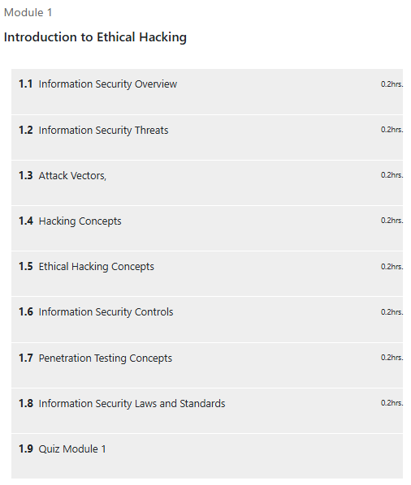
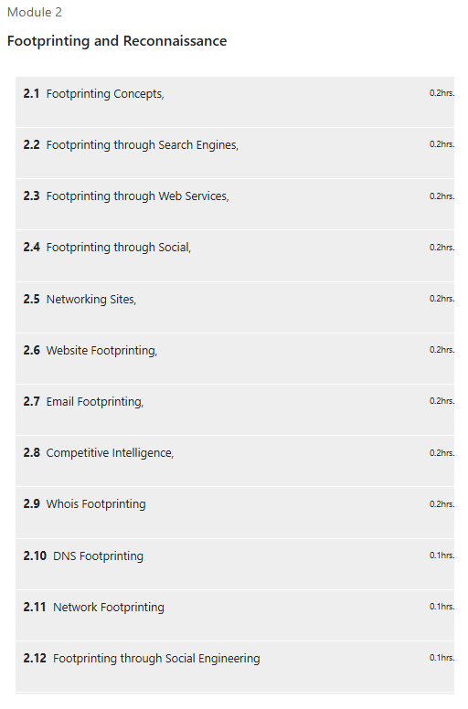

# 🛡️ Certificate Ethical Hacking – Henry Harvin Education

This repository contains **notes, labs, demos, guides, research case studies, and certificate of completion** for the *Ethical Hacking Program (Henry Harvin Education)*.  
The program provides a solid foundation in **penetration testing, vulnerability exploitation, incident response, and reporting methodologies**.

---

## 📚 Notes
- 📄 [01-introduction.md](./notes/01-introduction.md) – Introduction to Ethical Hacking  
- 📄 [02-footprinting-reconnaissance.md](./notes/02-footprinting-reconnaissance.md) – Footprinting & Reconnaissance  
- 📄 [03-scanning-networks.md](./notes/03-scanning-networks.md) – Scanning Networks  
- 📄 [04-enumeration.md](./notes/04-enumeration.md) – Enumeration  
- 📄 [05-system-hacking.md](./notes/05-system-hacking.md) – System Hacking  
- 📄 [06-malware-threats.md](./notes/06-malware-threats.md) – Malware Threats  
- 📄 [07-sniffing.md](./notes/07-sniffing.md) – Sniffing  
- 📄 [08-social-engineering.md](./notes/08-social-engineering.md) – Social Engineering  
- 📄 [09-denial-of-service.md](./notes/09-denial-of-service.md) – Denial of Service  
- 📄 [10-session-hijacking.md](./notes/10-session-hijacking.md) – Session Hijacking  
- 📄 [11-web-application-hacking.md](./notes/11-web-application-hacking.md) – Web Application Hacking  
- 📄 [12-sql-injection.md](./notes/12-sql-injection.md) – SQL Injection  
- 📄 [13-wireless-hacking.md](./notes/13-wireless-hacking.md) – Wireless Hacking  
- 📄 [14-cryptography.md](./notes/14-cryptography.md) – Cryptography  
- 📄 [15-reporting-mitigation.md](./notes/15-reporting-mitigation.md) – Reporting & Mitigation  

---

## 🧪 Labs
- 🔍 [labs/red-team-labs.md](./labs/red-team-labs.md) – Red Team practical labs  
- ✅ [labs/blue-team-defense.md](./labs/blue-team-defense.md) – Blue Team defense strategies  

---

## 🖥️ Demo
- 📝 [demo/demo-lab01.md](./demo/demo-lab01.md) – Reconnaissance & Scanning  
- 📝 [demo/demo-lab02.md](./demo/demo-lab02.md) – Web Application Exploitation  
- 📝 [demo/demo-lab03.md](./demo/demo-lab03.md) – Post-Exploitation & Reporting  

---

## 📖 Guides
- ⚙️ [guides/setup-environment.md](./guides/setup-environment.md) – Lab Setup Environment  
- 📑 [guides/penetration-testing-methodology.md](./guides/penetration-testing-methodology.md) – Pentest Methodology  
- 📝 [guides/reporting-guidelines.md](./guides/reporting-guidelines.md) – Reporting Guidelines  

---

## 🔬 Research & Extras
- 📑 [extras/case-studies.md](./extras/case-studies.md) – Case Studies  
- 📆 [extras/timeline.md](./extras/timeline.md) – Timeline of Attacks  
- 📚 [extras/resources.md](./extras/resources.md) – Additional Resources  

---

## 📘 Docs
- 📖 [docs/index.md](./docs/index.md) – Course Overview  
- 📘 [docs/syllabus.md](./docs/syllabus.md) – Course Syllabus  
- 📘 [docs/roadmap.md](./docs/roadmap.md) – Learning Roadmap  
- 📘 [docs/glossary.md](./docs/glossary.md) – Glossary of Terms  
- 📘 [docs/references.md](./docs/references.md) – References  

---

## 📸 Screenshots

| Module | Screenshot |
|--------|------------|
| 🏫 Module 1 |  |
| ⭐ Module 2 |  |

---

## 📜 Certificate
🎓 [Ethical Hacking – Henry Harvin Education](./cert/Free%20Certificate%20Ethical%20Hacking%20-%20Henry%20Harvin%20Education.jpg)

---

## 📝 Personal Review
This course enhanced my understanding of **ethical hacking methodologies, vulnerability analysis, and defense strategies**.  
It balanced both **Red Team exploitation techniques** and **Blue Team countermeasures**, making it a valuable program for building **practical cybersecurity skills**.

---

## ✍️ Author
**Thành Danh** – Red Team Learner & Security Researcher  

- GitHub: [@ngvuthdanhh](https://github.com/ngvuthdanhh)  
- Email: ngvu.thdanh@gmail.com  

---

## 📄 License
This project is licensed under the terms of the **MIT License**. See [LICENSE](./LICENSE) for details.  
© 2025 ngvuthdanhh. All rights reserved.  
